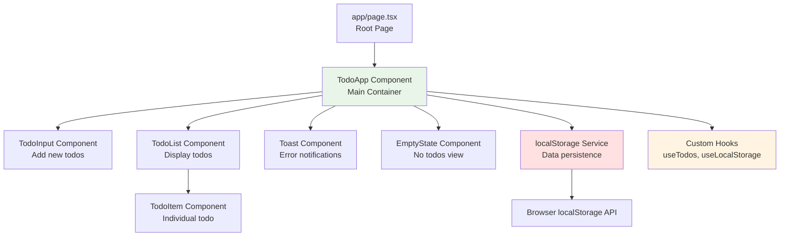

# Components

The application follows a component-based architecture with clear separation of concerns. Components are organized by responsibility: presentation, business logic, and data persistence.

### Component Architecture Overview



### TodoApp Component (Main Container)

**Responsibility:** Root application component that manages global todo state, coordinates all child components, and handles data persistence through the storage service layer.

**Key Interfaces:**
- Exports: React component (default export)
- Props: None (root component)
- State: `todos: Todo[]`, `error: string | null`

**Dependencies:** TodoInput, TodoList, Toast, EmptyState, localStorage service, useTodos hook

**Technology Stack:** React 18 Client Component (`'use client'`), TypeScript, Tailwind CSS for layout

**Key Responsibilities:**
- Initialize todos from localStorage on mount
- Provide CRUD operations to child components via callbacks
- Handle errors and display toast notifications
- Conditionally render EmptyState vs TodoList based on todos length

### TodoInput Component

**Responsibility:** Input field and submit button for adding new todos. Handles text input validation and Enter key submission.

**Key Interfaces:**
- Props: `onAddTodo: (text: string) => void`
- Emits: `onAddTodo` callback with validated text
- Internal state: `inputValue: string`

**Dependencies:** None (pure presentational component)

**Technology Stack:** React controlled input, Tailwind CSS, TypeScript

**Key Responsibilities:**
- Validate input (non-empty, max 500 chars)
- Handle Enter key and button click submission
- Clear input after successful submission
- Provide visual feedback for invalid input

### TodoList Component

**Responsibility:** Renders a list of TodoItem components. Handles sorting and provides callbacks to child items.

**Key Interfaces:**
- Props: `todos: Todo[]`, `onToggleTodo: (id: string) => void`, `onEditTodo: (id: string, text: string) => void`, `onDeleteTodo: (id: string) => void`
- Renders: Array of TodoItem components

**Dependencies:** TodoItem component

**Technology Stack:** React, Array.map() for rendering, Tailwind CSS for list styling

**Key Responsibilities:**
- Sort todos by createdAt (newest first)
- Pass appropriate callbacks to each TodoItem
- Handle empty array case gracefully

### TodoItem Component

**Responsibility:** Displays a single todo with checkbox, text, edit, and delete buttons. Manages inline editing state.

**Key Interfaces:**
- Props: `todo: Todo`, `onToggle: () => void`, `onEdit: (text: string) => void`, `onDelete: () => void`
- Internal state: `isEditing: boolean`, `editText: string`

**Dependencies:** None (leaf component)

**Technology Stack:** React, Tailwind CSS with hover states, inline edit mode

**Key Responsibilities:**
- Display todo text with strikethrough if completed
- Toggle completion status via checkbox
- Enter edit mode on edit button click
- Validate and save edited text on Enter or save button
- Cancel editing on Escape key
- Delete todo on delete button click

### Toast Component

**Responsibility:** Non-intrusive notification system for displaying error messages and success feedback.

**Key Interfaces:**
- Props: `message: string | null`, `type: 'error' | 'success' | 'info'`, `onDismiss: () => void`
- Auto-dismiss: Timer to clear after 5 seconds

**Dependencies:** None

**Technology Stack:** React, Tailwind CSS animations, conditional rendering

**Key Responsibilities:**
- Display message with appropriate styling based on type
- Auto-dismiss after 5 seconds
- Provide manual dismiss button
- Animate entrance and exit

### EmptyState Component

**Responsibility:** Welcoming view when no todos exist, encouraging users to add their first todo.

**Key Interfaces:**
- Props: None (pure presentational)

**Dependencies:** None

**Technology Stack:** React, Tailwind CSS, possibly an SVG icon

**Key Responsibilities:**
- Display encouraging message
- Provide visual indicator (icon or illustration)
- Match overall app aesthetic

### localStorage Service

**Responsibility:** Type-safe wrapper around browser localStorage API for reading/writing todo data with error handling.

**Key Interfaces:**
```typescript
export const todoStorage = {
  loadTodos: (): Todo[] => { ... },
  saveTodos: (todos: Todo[]): void => { ... },
  clearTodos: (): void => { ... }
};
```

**Dependencies:** Todo interface, TODO_CONSTRAINTS

**Technology Stack:** TypeScript, native localStorage API, JSON serialization

**Key Responsibilities:**
- Serialize/deserialize Todo[] to/from JSON
- Handle localStorage unavailable/disabled scenarios
- Handle JSON parse errors gracefully
- Provide clear error messages for quota exceeded
- Validate data structure on load

### useTodos Custom Hook

**Responsibility:** Encapsulates todo management logic including CRUD operations and localStorage synchronization.

**Key Interfaces:**
```typescript
export function useTodos() {
  return {
    todos: Todo[],
    addTodo: (text: string) => void,
    updateTodo: (id: string, updates: UpdateTodoInput) => void,
    deleteTodo: (id: string) => void,
    toggleTodo: (id: string) => void,
    error: string | null,
    clearError: () => void
  };
}
```

**Dependencies:** useState, useEffect, todoStorage service

**Technology Stack:** React Hooks, TypeScript

**Key Responsibilities:**
- Manage todos array state
- Provide CRUD operation functions
- Sync state changes to localStorage
- Handle and expose errors
- Load initial data on mount

