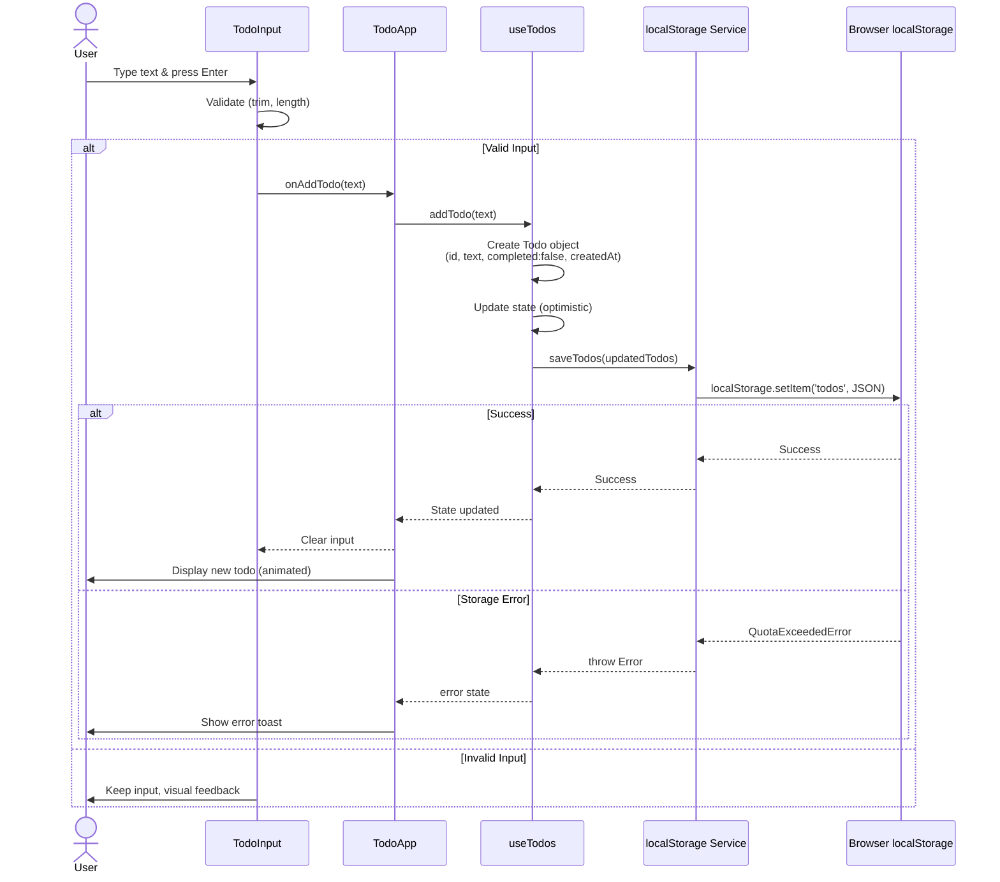
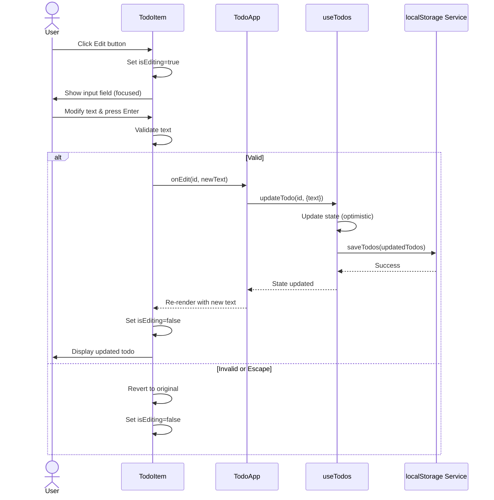
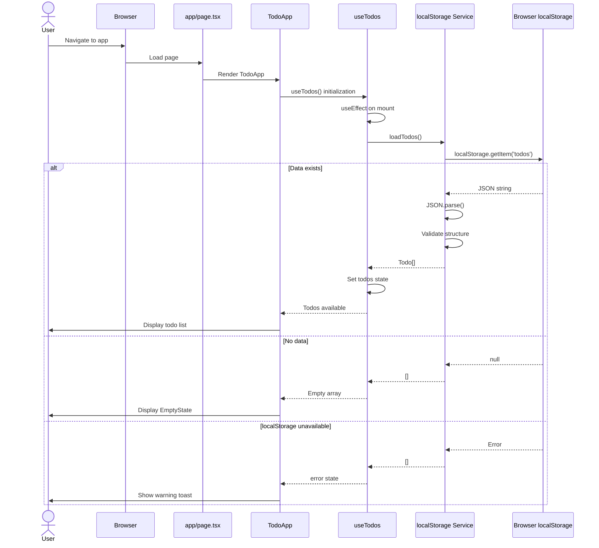

# Core Workflows

The following sequence diagrams illustrate critical user journeys and system interactions.

### Add Todo Workflow

```mermaid
sequenceDiagram
    actor User
    participant Input as TodoInput
    participant App as TodoApp
    participant Hook as useTodos
    participant Storage as localStorage Service
    participant LS as Browser localStorage

    User->>Input: Type text & press Enter
    Input->>Input: Validate (trim, length)
    alt Valid Input
        Input->>App: onAddTodo(text)
        App->>Hook: addTodo(text)
        Hook->>Hook: Create Todo object<br/>(id, text, completed:false, createdAt)
        Hook->>Hook: Update state (optimistic)
        Hook->>Storage: saveTodos(updatedTodos)
        Storage->>LS: localStorage.setItem('todos', JSON)
        alt Success
            LS-->>Storage: Success
            Storage-->>Hook: Success
            Hook-->>App: State updated
            App-->>Input: Clear input
            App->>User: Display new todo (animated)
        else Storage Error
            LS-->>Storage: QuotaExceededError
            Storage-->>Hook: throw Error
            Hook-->>App: error state
            App->>User: Show error toast
        end
    else Invalid Input
        Input->>User: Keep input, visual feedback
    end
```

### Edit Todo Workflow

```mermaid
sequenceDiagram
    actor User
    participant Item as TodoItem
    participant App as TodoApp
    participant Hook as useTodos
    participant Storage as localStorage Service

    User->>Item: Click Edit button
    Item->>Item: Set isEditing=true
    Item->>User: Show input field (focused)
    User->>Item: Modify text & press Enter
    Item->>Item: Validate text
    alt Valid
        Item->>App: onEdit(id, newText)
        App->>Hook: updateTodo(id, {text})
        Hook->>Hook: Update state (optimistic)
        Hook->>Storage: saveTodos(updatedTodos)
        Storage-->>Hook: Success
        Hook-->>App: State updated
        App-->>Item: Re-render with new text
        Item->>Item: Set isEditing=false
        Item->>User: Display updated todo
    else Invalid or Escape
        Item->>Item: Revert to original
        Item->>Item: Set isEditing=false
    end
```

### Application Load Workflow

```mermaid
sequenceDiagram
    actor User
    participant Browser
    participant Page as app/page.tsx
    participant App as TodoApp
    participant Hook as useTodos
    participant Storage as localStorage Service
    participant LS as Browser localStorage

    User->>Browser: Navigate to app
    Browser->>Page: Load page
    Page->>App: Render TodoApp
    App->>Hook: useTodos() initialization
    Hook->>Hook: useEffect on mount
    Hook->>Storage: loadTodos()
    Storage->>LS: localStorage.getItem('todos')
    alt Data exists
        LS-->>Storage: JSON string
        Storage->>Storage: JSON.parse()
        Storage->>Storage: Validate structure
        Storage-->>Hook: Todo[]
        Hook->>Hook: Set todos state
        Hook-->>App: Todos available
        App->>User: Display todo list
    else No data
        LS-->>Storage: null
        Storage-->>Hook: []
        Hook-->>App: Empty array
        App->>User: Display EmptyState
    else localStorage unavailable
        LS-->>Storage: Error
        Storage-->>Hook: []
        Hook-->>App: error state
        App->>User: Show warning toast
    end
```
