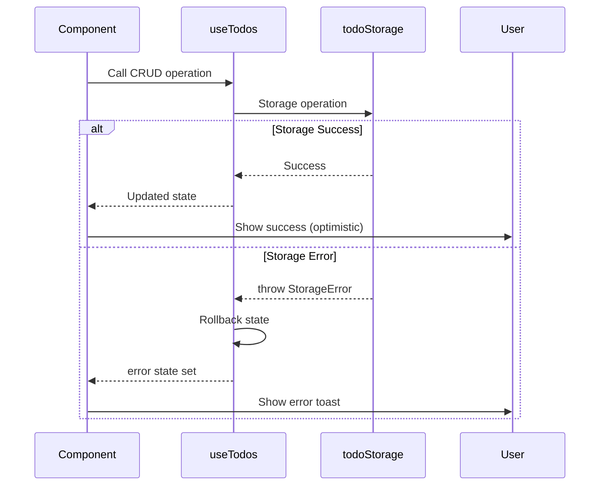

# Error Handling Strategy

### Error Flow



### Error Response Format

```typescript
// Standardized error type
export class StorageError extends Error {
  constructor(
    message: string,
    public code: 'UNAVAILABLE' | 'QUOTA_EXCEEDED' | 'SAVE_ERROR' | 'LOAD_ERROR'
  ) {
    super(message);
    this.name = 'StorageError';
  }
}

// User-friendly error messages
export const ERROR_MESSAGES = {
  UNAVAILABLE: 'Storage is not available. Your todos will not be saved.',
  QUOTA_EXCEEDED: 'Storage limit reached. Please delete some todos to free up space.',
  SAVE_ERROR: 'Failed to save your changes. Please try again.',
  LOAD_ERROR: 'Failed to load your todos. Please refresh the page.',
} as const;
```

### Frontend Error Handling Pattern

```typescript
// In useTodos hook
try {
  todoStorage.saveTodos(updatedTodos);
  setError(null);
} catch (err) {
  // User-friendly message
  const message =
    err instanceof StorageError
      ? ERROR_MESSAGES[err.code] || err.message
      : 'An unexpected error occurred';

  setError(message);

  // Rollback optimistic update
  setTodos(previousTodos);

  // Log for debugging
  console.error('Storage operation failed:', err);
}
```

### React Error Boundary

```typescript
// app/error.tsx
'use client';

import { useEffect } from 'react';

export default function Error({
  error,
  reset,
}: {
  error: Error & { digest?: string };
  reset: () => void;
}) {
  useEffect(() => {
    console.error('Application error:', error);
  }, [error]);

  return (
    <div className="flex min-h-screen items-center justify-center p-4">
      <div className="text-center">
        <h2 className="text-2xl font-bold mb-4">Something went wrong!</h2>
        <p className="text-gray-600 mb-6">
          We encountered an unexpected error. Please try refreshing the page.
        </p>
        <button
          onClick={reset}
          className="px-4 py-2 bg-blue-500 text-white rounded hover:bg-blue-600"
        >
          Try again
        </button>
      </div>
    </div>
  );
}
```
