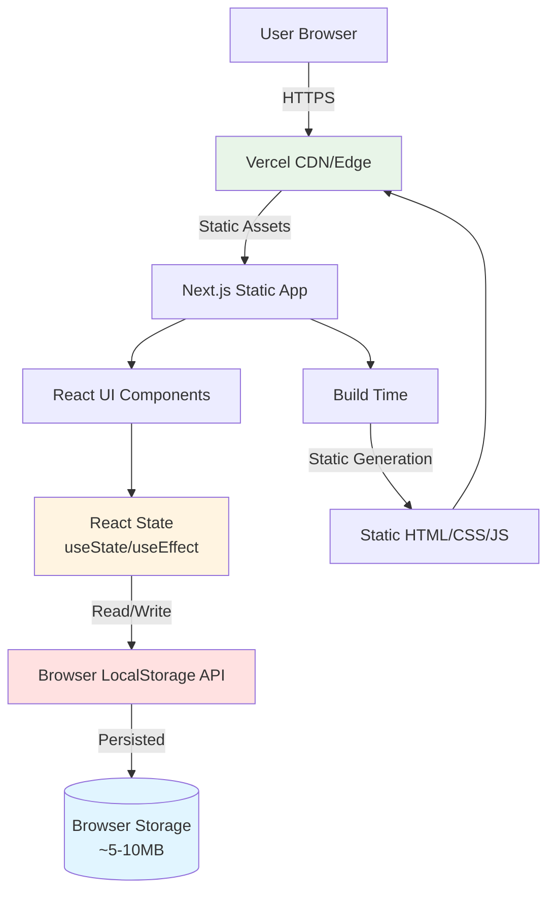

# High Level Architecture

### Technical Summary

The Todo List App employs a **client-side Jamstack architecture** with Next.js 14 App Router serving pre-rendered static pages enhanced with client-side React interactivity. All application state resides in the browser using React's `useState` and `useEffect` hooks, with the browser's Local Storage API providing persistent data storage across sessions.

The architecture eliminates backend infrastructure entirely—no API servers, databases, or authentication services are required. The application consists of a single-page interface that loads instantly from a CDN, executes all business logic client-side in JavaScript, and stores todo data directly in the user's browser. This approach delivers sub-second load times, zero server costs, and offline-first capabilities while maintaining a modern, component-based React architecture.

Key integration points are minimal: Next.js handles build-time optimization and static generation, Tailwind CSS provides utility-first styling, and the browser's native APIs (localStorage, crypto.randomUUID) handle persistence and ID generation. Deployment to Vercel or similar platforms requires no configuration beyond pointing to the build output directory.

### Platform and Infrastructure Choice

**Platform:** Vercel  
**Key Services:** Vercel CDN, Edge Network, Static Hosting  
**Deployment Host and Regions:** Global Edge Network (automatic)

**Rationale:** Vercel provides optimal Next.js integration with zero-config deployment, automatic HTTPS, global CDN distribution, and preview deployments for each PR. The free tier is sufficient for this learning project. Alternative options considered: Netlify (similar features, slightly less Next.js optimization) and GitHub Pages (free but requires manual CI/CD setup).

### Repository Structure

**Structure:** Monorepo (Single-package)  
**Monorepo Tool:** N/A (standard Next.js structure)  
**Package Organization:** Standard Next.js App Router layout with clear directory separation

Since this is a self-contained client-side application with no shared packages or microservices, a traditional monorepo tool (Nx, Turborepo) would add unnecessary complexity. The project uses a standard Next.js single-package structure with clear separation of concerns through directory organization.

### High Level Architecture Diagram

### Architectural Patterns

- **Jamstack Architecture:** Static site generation with client-side hydration - _Rationale:_ Eliminates backend complexity, provides instant page loads, and enables deployment to simple static hosting with global CDN distribution

- **Component-Based UI:** Atomic React components with clear single responsibilities - _Rationale:_ Promotes reusability, testability, and maintainability; components can be developed independently by AI agents

- **Optimistic UI Updates:** UI updates immediately before persistence completes - _Rationale:_ Meets NFR3 requirement for <100ms visual feedback; provides snappy user experience even on slow devices

- **Client-Side State Management (Hooks):** React useState and useEffect without external libraries - _Rationale:_ Sufficient for the limited scope (single view, no complex state); avoids Redux/Zustand overhead for a learning project

- **Utility-First CSS:** Tailwind CSS for styling - _Rationale:_ Rapid UI development, built-in responsive design, consistent design system, and minimal custom CSS

- **Type-Safe Data Layer:** TypeScript interfaces with strict mode - _Rationale:_ Catches errors at compile time, provides IDE autocomplete, and serves as living documentation

- **Error Boundary Pattern:** React error boundaries for graceful degradation - _Rationale:_ Prevents white-screen errors, provides user-friendly error messages, and maintains application stability

